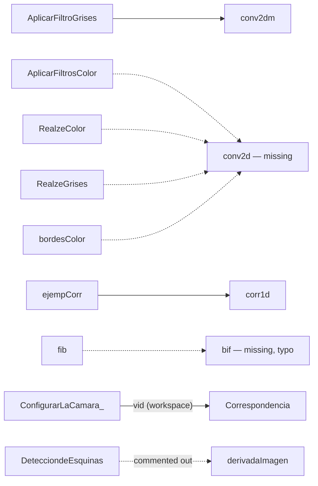

# Code Overview

A file-by-file description of the original MATLAB code. Nothing in `src/` was modified; this document only explains it. Original Spanish names are kept, with an English translation where useful.

**Legend.** *Script* = runs top to bottom in the base workspace. *Function* = callable file (`function ... end`). *GUI* = GUIDE application.

## Execution model

- There is no entry point, build step, or package. Each script is run individually from the MATLAB command window or editor.
- Scripts typically start with `clear`/`clc`, read an image from the **current folder** with `imread`, process it, and show the result with `imshow` / `imshowpair`.
- Helper functions are resolved through the MATLAB path. Originally everything lived in one folder; after the reorganization use `addpath(genpath('src/image-processing'))` (see the [README](../README.md#running-the-project)).
- `Correspondencia.m` depends on the variable `vid` created by `ConfigurarLaCamara_.m` in the same workspace.

## Dependency map

Only calls between files of this repository are shown (toolbox functions omitted).

The Canny helper functions (`derivadaImagen`, `magnitudGradiente`, `orientacionGradiente`, `supresionNoMaximos`, `filtradoHisteresis`) are **not** called by `algoritmoCanny.m`, which implements every stage inline. They appear to be a modular version of the same pipeline intended to be chained manually.

## `src/image-processing/filtering/`

| File | Type | Description |
|---|---|---|
| `conv2dm.m` | Function | Manual 2‑D convolution. Zero-pads the image by `floor(m/2)`, loops over every pixel and every kernel element (kernel flipped via reversed loops), stores into a `uint8` image and crops back to the original size. Returns `ImC`. Internally declared as `conv2dz` (the file name is what MATLAB uses). |
| `conv2dz.m` | Function | Same algorithm as `conv2dm.m` but returns both the padded result `ImCZ` and the cropped result `ImC`. |
| `AplicarFiltroGrises.m` | Script | "Apply grayscale filter": builds a 3×3 binomial kernel with `conv2([1 2 1],[1;2;1]/16)`, converts `Capture.JPG` to gray and smooths it with `conv2dm`. A 5×5 kernel is left commented out. |
| `AplicarFiltrosColor.m` | Script | "Apply color filters": smooths each RGB channel of `Capture.JPG` with a 4×4 binomial kernel (`/64`) via `conv2d`, saves and shows `newImage.jpg`. |
| `filtroMediana.m` | Script | "Median filter": adds 5 % salt & pepper noise to `Capture2.JPG` and removes it with `medfilt2`; shows both side by side. |
| `Reducir_imagen.m` | Script | "Reduce image": downsamples `Capture.JPG` by 2 in each dimension by taking every other pixel; saves `newImage2.jpg`. |

## `src/image-processing/enhancement/`

| File | Type | Description |
|---|---|---|
| `RealzeGrises.m` | Script | "Grayscale enhancement": `edges = I − smooth(I)`, then `I + 16·edges` (unsharp masking) on `Capture2.JPG`. |
| `RealzeColor.m` | Script | Same idea per RGB channel with gain `a = 4`; saves `newImage.jpg`. |

## `src/image-processing/histograms/`

| File | Type | Description |
|---|---|---|
| `histograma.m` | Function | 256-bin histogram computed with explicit loops; plots it with `bar`. |
| `histogramanormalizado.m` | Function | Histogram divided by the number of pixels (probabilities). |
| `histogramaecualizado.m` | Function | Normalized histogram → cumulative sum → scaled by 256: the equalization mapping. Plots counts against the new levels. |
| `HistogramaFrecuenciaAcumulada.m` | Script | Worked example on a 4×4 matrix with levels 0–9: histogram, cumulative frequency (`FA`), normalized cumulative frequency (`FAN`), the equalized image `L·FAN(A+1)` and its new histogram. |

## `src/image-processing/derivatives-and-edges/`

| File | Type | Description |
|---|---|---|
| `DerivadasDeVectoresDiscretos.m` | Script | Forward, backward and central discrete derivatives of `x²` sampled on −3..3, plotted against the continuous derivative `2x`. |
| `DerivadasDeMatrizesDiscretas.m` | Script | Horizontal + vertical discrete derivatives of `Capture.JPG` with `[-1 1]` and `[1 0 -1]`; compares both edge maps with `imshowpair`. |
| `derivadaImagen.m` | Function | Returns Sobel `x` and `y` derivatives of an image. Prewitt version is commented out. |
| `magnitudGradiente.m` | Function | `sqrt(x.^2 + y.^2)`. |
| `orientacionGradiente.m` | Function | `atan2(y, x)` (radians). |
| `bordesGrises.m` | Script | Grayscale edges as `I − imfilter(I, binomial)`. |
| `bordesColor.m` | Script | Same per RGB channel using `conv2d`; saves `newImage.jpg`. |
| `deteccionDeBordes.m` | Script | Smooths `Capture.JPG`, runs Prewitt, Sobel, LoG and Canny (`edge`) and shows their sum. Also computes an unused amplified smoothing-difference image `I5`. |

## `src/image-processing/canny/`

| File | Type | Description |
|---|---|---|
| `algoritmoCanny.m` | Script | Complete hand-written Canny on `clonetrooper.jpg`: Sobel derivatives → magnitude and orientation (degrees) → orientation mapped to [0,180) and quantized to 0/45/90/135 → non‑maximum suppression along the gradient direction → thresholds `TH = 0.175·max`, `TL = 0.075·max` → hysteresis using the 8 neighbours → logical edge image. Comments are in Spanish with accents (Latin‑1). |
| `supresionNoMaximos.m` | Function | Non-maximum suppression given magnitude and a quantized orientation (0/45/90/135). |
| `filtradoHisteresis.m` | Function | The double-threshold + hysteresis stage from `algoritmoCanny.m` as a function returning `bordesFuertes` ("strong edges"). |

## `src/image-processing/corners/`

| File | Type | Description |
|---|---|---|
| `algoritmoHarris.m` | Script | Hand-written Harris detector on `chess.png`: Prewitt-like derivatives, products `Ix²`, `Iy²`, `IxIy`, 5×5 normalized Gaussian window (σ = 1), response `R = det(H) − 0.04·trace(H)²`, 3×3 local-maximum suppression, threshold at 1 % of the maximum; shows `R > 0`. |
| `DetecciondeEsquinas.m` | Script | "Corner detection": toolbox `corner()` on `KDGf2Nkg.png`, plotting the points. Contains a commented-out earlier manual Harris attempt using `derivadaImagen`. |

## `src/image-processing/hough/`

| File | Type | Description |
|---|---|---|
| `Hough.m` | Script | Manual Hough transform attempt on a synthetic 60×40 image with two white pixels: fills a 180×180 accumulator. Unfinished (comments list "find the maximum" and "compute the line" as next steps); the function wrapper is commented out. |
| `CanyHoughLIneas.m` | Script | "Canny + Hough lines" with toolbox functions: `edge(...,'canny')`, `hough`, `houghpeaks`, `houghlines`; plots detected segments and highlights the longest one. Uses a synthetic image (reading `Capture2.JPG` is commented out). Structure closely follows the MATLAB `houghlines` documentation example. |

## `src/image-processing/segmentation/`

| File | Type | Description |
|---|---|---|
| `pantallaVerde.m` | Script | "Green screen": builds a mask of pixels whose green channel is > 180 in `Capture3.JPG`, subtracts it from every channel, then copies non-zero pixels into `im2`. The background image (`fondo.jpg`) is commented out. |

## `src/image-processing/camera-and-matching/`

| File | Type | Description |
|---|---|---|
| `ConfigurarLaCamara_.m` | Script | "Configure the camera": lists image-acquisition hardware, creates `vid = videoinput('winvideo')` and opens a preview. |
| `Correspondencia.m` | Script | "Correspondence": takes two snapshots from `vid`, detects Harris features in each, extracts descriptors, matches them and displays the first 10 matches as a montage. |

## `src/gui/`

| File | Type | Description |
|---|---|---|
| `Proyecto.m` | GUI | GUIDE-generated application (last modified 16‑Nov‑2018). `pushbutton1` loads an image via `uigetfile` into a global variable and shows it in `axes3`. Selecting a radio button in `uibuttongroup1` converts it to gray and shows in `axes4`: **radiobutton1** → `edge(...,'canny')`; **radiobutton2** → `imfilter` with `[1 3 1;3 3 3;1 3 1]/19`; **radiobutton3** → sharpening `I + 20·(I − imgaussfilt(I))`. `pushbutton2` saves the result with `uiputfile`/`imwrite`. Requires `Proyecto.fig` (not in the repository). |

## `src/matlab-fundamentals/`

General programming exercises, not specific to images.

| File | Type | Description |
|---|---|---|
| `alumnos.m` | Function | Counts passing (`> 59`) and failing grades in a vector. |
| `diferencia.m` | Function | Forward difference of a vector, last element set to 0. |
| `ecm.m` | Function | Mean squared error (*error cuadrático medio*) of two vectors, returned with `vpa`. |
| `eliminaNegativos.m` | Function | Returns the vector without negative values. |
| `interseccion.m` | Function | Set intersection of two vectors with duplicates removed, using explicit loops. |
| `union.m` | Function | Set union of two vectors without duplicates, using explicit loops. |
| `minMax.m` | Function | Minimum and maximum of a row vector via a loop. |
| `serie.m` | Function | Partial sum of the Taylor series of `e^x` from `x^0` up to `x^n`. |
| `sumSerie.m` | Function | Adds `2/x` to an accumulator `n` times. |
| `solucionEcuacion.m` | Function | Solves the linear system `a\b`. |

## `src/mini-problems/`

Short early exercises (the original folder was `Mini Problems/`).

| File | Type | Description |
|---|---|---|
| `Sumita.m` | Script | Reads two numbers with `input` and prints their sum. |
| `Graficar.m` | Script | Basic 2‑D plot with labels and grid. |
| `Apuntes.m` | Script | Class notes ("apuntes"): 3‑D plot with `plot3`; commented notes on `meshgrid`/`mesh`, `save` and `ls`. |
| `Ecuacion.m` | Script | Evaluates `x² + 2x − 1` on −3..3. |
| `Tarea 1.m` | Script | "Homework 1": evaluates `sin(cos(√2·√(x²)))` on −10..10. |
| `T1.m` | Script | Homework 1 final version: evaluates and plots the same function on −2..4 ("Función rara"). |
| `Imagen1.m` | Script | Creates a black 256×256 `uint8` image with one white pixel. |
| `actividad en calase factorial.m` | Script | In-class factorial attempt; relies on a variable `a` defined elsewhere. |
| `factorial.m` | Script + local function | Recursive factorial; an earlier iterative version is commented out. |
| `fib.m` | Script + local function | Recursive Fibonacci. |
| `conv1d.m` | Function | Manual 1‑D full convolution. |
| `corr1d.m` | Function | Intended 1‑D correlation (see notes in [possible-improvements.md](possible-improvements.md)). |
| `ejempCorr.m` | Script | "Correlation example": builds a signal that contains `x0`, correlates to find the delay and plots `x0` aligned over `x1`. |
| `mask.m` | Script | Subtracts a grayscale mask image (`negra.png`) from `Capture.PNG` pixel by pixel. |

## Input files referenced by the code

None of these files are in the repository.

| File | Used by |
|---|---|
| `Capture.JPG` | `AplicarFiltroGrises`, `AplicarFiltrosColor`, `Reducir_imagen`, `DerivadasDeMatrizesDiscretas`, `bordesGrises`, `deteccionDeBordes` |
| `Capture2.JPG` | `RealzeColor`, `RealzeGrises`, `bordesColor`, `filtroMediana`, (`CanyHoughLIneas`, commented) |
| `Capture3.JPG` | `pantallaVerde` |
| `Capture.PNG`, `negra.png` | `mask` |
| `KDGf2Nkg.png` | `DetecciondeEsquinas` |
| `clonetrooper.jpg` | `algoritmoCanny` |
| `chess.png` | `algoritmoHarris` |
| `fondo.jpg` | `pantallaVerde` (commented) |
| `Proyecto.fig` | `Proyecto` |

## Output files generated by the code

| File | Written by |
|---|---|
| `newImage.jpg` | `AplicarFiltrosColor`, `RealzeColor`, `bordesColor` |
| `newImage2.jpg` | `Reducir_imagen` |
| user-chosen file | `Proyecto` (save button) |
